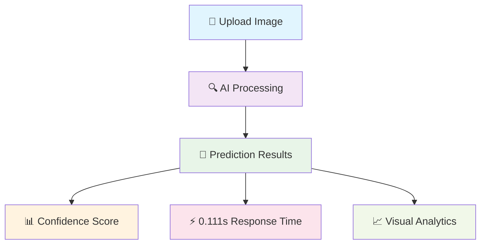

# 🚦 Indian Traffic Sign Recognition System

<div align="center">


**🎯 AI-Powered Traffic Sign Recognition with 92.25% Accuracy**

*Revolutionizing road safety through advanced computer vision and deep learning*

</div>

---

## 🌟 **Project Highlights**

<table align="center">
<tr>
<td align="center">
  
  <br><b>🧠 Smart AI Model</b>
  <br>EfficientNet-B0 Architecture
  <br>4.69M Parameters
</td>
<td align="center">
  
  <br><b>⚡ Lightning Fast</b>
  <br>Real-time Predictions
  <br>0.111 seconds per image
</td>
<td align="center">
  
  <br><b>🎯 High Accuracy</b>
  <br>92.25% Validation
  <br>59 Traffic Sign Classes
</td>
<td align="center">
  
  <br><b>🌐 Web Application</b>
  <br>Interactive Interface
  <br>Drag & Drop Upload
</td>
</tr>
</table>

---

## 🎮 **Live Demo - Experience the Magic**

### 🖥️ **Streamlit Web Application Interface**

<div align="center">


*🎨 Clean, intuitive interface showcasing model performance metrics and upload functionality*

</div>

### 🎯 **AI Prediction in Action**

<div align="center">


*⚡ Real-time traffic sign recognition with confidence scoring and detailed analysis*

</div>

### 📊 **Confidence Analysis Dashboard**

<div align="center">


*📈 Comprehensive prediction confidence visualization with ranked results*

</div>

---

## 🚀 **Quick Start Guide**

### 🛠️ **Installation**

```bash
# 📥 Clone the repository
git clone https://github.com/your-username/indian-traffic-sign-recognition.git
cd indian-traffic-sign-recognition

# 🐍 Create virtual environment
python -m venv venv
source venv/bin/activate  # On Windows: venv\Scripts\activate

# 📦 Install dependencies
pip install -r requirements.txt
```

### 🤖 **Download Pre-trained Model**

<div align="center">

| 📊 **Model Details** | 📝 **Information** |
|:---:|:---:|
| **Architecture** | EfficientNet-B0 |
| **Accuracy** | 92.25% |
| **File Size** | 56.8 MB |
| **Classes** | 59 Indian Traffic Signs |

</div>

```bash
# 📥 Download from Google Drive
https://drive.google.com/file/d/1yPQvs6tOAvhQKbpGJYgO7JCItQJCMRbw/view?usp=sharing

# 📁 Place in models directory
mkdir models
# Move downloaded file to: models/best_model.pth
```

### 🎮 **Launch Application**

```bash
# 🚀 Start Streamlit app
streamlit run streamlit_app.py

# 🌐 Open browser and navigate to:
# http://localhost:8501
```

---

## 🏆 **Model Performance**

<div align="center">

### 📈 **Training Results**

| 🎯 **Metric** | 📊 **Score** | 🎨 **Status** |
|:---:|:---:|:---:|
| **Validation Accuracy** | 92.25% |  |
| **Training Images** | 13,971 |  |
| **Training Epochs** | 25 |  |
| **Training Time** | 5.8 Hours |  |
| **Model Parameters** | 4.69M |  |

</div>

---

## 🎨 **Key Features**

<div align="center">



</div>

### ✨ **Core Capabilities**

- 🎯 **High Accuracy Recognition**: 92.25% validation accuracy across 59 traffic sign classes
- ⚡ **Real-time Processing**: Lightning-fast predictions in just 0.111 seconds
- 🎨 **Interactive Interface**: User-friendly Streamlit web application
- 📊 **Detailed Analytics**: Confidence scoring and prediction visualization
- 🚀 **Production Ready**: Optimized EfficientNet-B0 architecture
- 📱 **Responsive Design**: Works seamlessly across devices

---

## 🛣️ **Supported Traffic Signs**

<div align="center">

| 🚫 **Prohibition** | ⚠️ **Warning** | ℹ️ **Information** | 🎯 **Mandatory** |
|:---:|:---:|:---:|:---:|
| No Entry | Speed Limit | Parking | Keep Right |
| No Overtaking | Sharp Turn | Hospital | Roundabout |
| No U-Turn | School Zone | Fuel Station | Traffic Light |

*And 47+ more traffic sign categories...*

</div>

---

## 🔧 **Technical Architecture**

<div align="center">

```
📊 Data Pipeline
├── 🖼️  Image Preprocessing
├── 🔄  Data Augmentation  
├── 🎯  EfficientNet-B0 Model
├── ⚡  Real-time Inference
└── 🎨  Streamlit Interface
```

</div>

### 🧠 **Model Architecture**

- **Base Model**: EfficientNet-B0 (Pre-trained on ImageNet)
- **Fine-tuning**: Custom classification head for Indian traffic signs
- **Optimization**: Adam optimizer with learning rate scheduling
- **Regularization**: Dropout and data augmentation for robust training

---

## 📈 **Performance Metrics**

<div align="center">


*📊 Training and validation accuracy progression over 25 epochs*

</div>

---

## 🤝 **Contributing**

We welcome contributions! Here's how you can help:

- 🐛 **Bug Reports**: Found an issue? Let us know!
- ✨ **Feature Requests**: Have ideas for improvements?
- 📝 **Documentation**: Help improve our docs
- 🧪 **Testing**: Add test cases and improve coverage

---

## 📄 **License**

This project is licensed under the MIT License - see the [LICENSE](LICENSE) file for details.

---

<div align="center">

### 🌟 **Star this repository if you found it helpful!**

**Made with ❤️ by [Your Name]**


</div>
